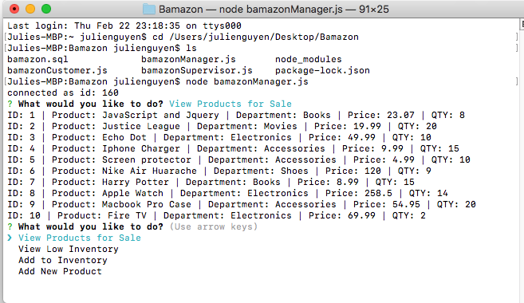
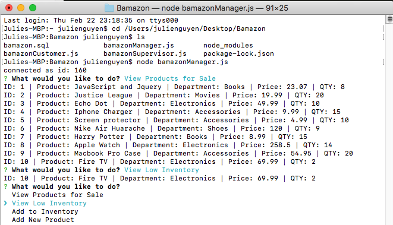
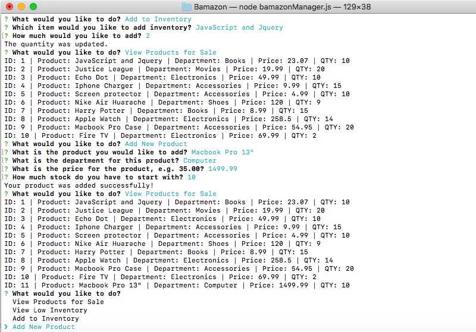

#bamazon

### Overview
This application is an Amazon-like storefront with [MySQL](https://www.npmjs.com/package/mysql) & [Node.JS](https://www.npmjs.com/).

### Node.js
Three JavaScript files replicate the basics of a simple ecommerce engine:

- `bamazonCustomer.js`
  -  Running this application will first display all of the items available for sale. Include the ids, names, and prices of products for sale.

  (Images/bamazonCustomer.png)

- `bamazonManager.js` 
 - The manager module lets managers view the list of products, view low inventory, add inventory, and add products.
  - A sample of the menu is below:
    * View Products for Sale 
    

    * View Low Inventory
    

    * Add to Inventory
    ![Screenshot] (Images/bamazonManagerInventory.png)

    * Add New Product
    

## Technologies used
- Node.js
- Inquire NPM Package (https://www.npmjs.com/package/inquirer)
- MYSQL NPM Package (https://www.npmjs.com/package/mysql)

### Prerequisites

- Node.js 
- Create a MYSQL database called 'bamazon_db', reference schema.sql

## Authors
**Julie Nguyen** https://github.com/julienguyen86/Bamazon
	
